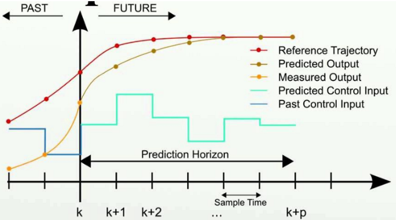
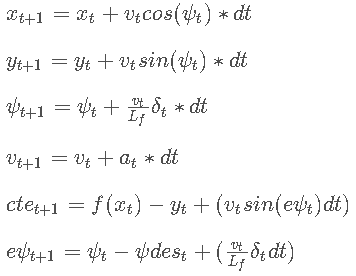
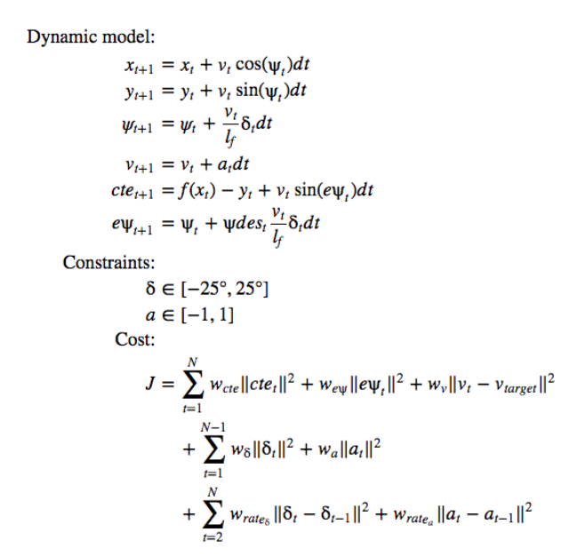

# CarND-Controls-MPC
Self-Driving Car Engineer Nanodegree Program

---

## **Project Description**

## Overview
**Model Predictive Controller (MPC)** is an advanced method of process control considering a set of constraints. In other words, MPC can predict the best route along the reference trajectory based on the current vehicle’s motion. Furthermore, we can define how vehicle move by adding constraints and a combination of costs (such as staying close to the trajectory and prevent jerking the steering wheel too quickly). MPC transforms the process control to an optimization problem and calculates a solution with minimum cost. After that, the vehicle follows the resulting trajectory and repeat optimization again. 



Compared with PID controller, MPC can take the current motions into account and anticipate the future events. Thus, it effectively addresses the issue of delayed execution of commands. 

## Model

* Here we used a simplified **kinetic model** including 4 components. Besides that, we add two move components for describing the deviation from the reference trajectory. 
    * Location of the vehicle, (x, y)
    * Heading direction psi
    * Vehicle speed v
    * Cross track error cte
    * Orientation error epsi

* There are two necessary **constraints** for actuator considering the real condition.
    * Steering: bounded in range [-25°, 25°]
    * Acceleration: bounded in range [-1, 1] from full brake to full throttle

* The **update equations** used to predict the new state from the current state is shown below

    

  Here Lf is the distance between the front of vehicle and its center of gravity. The larger vehicle is, the slower turn rate is. 

* The **cost function** consists of three parts for various objectives: fit the reference trajectory, minimize the use of actuators, minimize the value gap between sequential actuations. Usually the main terms are based on reference state. Other regularization terms are presented to enforce the smooth controller response (e.g. avoid abrupt steering). All the cost terms are listed below:
    * Cross track error
    * Heading error
    * Speed cost (prefer staying at specified speed)
    * Steering cost 
    * Acceleration cost 
    * Steering rate change
    * Acceleration rate change

* Now we put all the components together to set up the complete model. 

    

## Timestep Length and Elapsed Duration
The prediction horizon is the duration over which future predictions are made. N is the number of timesteps in the horizon and dt is how much time elapses between actuations. 
The general guidelines indicate that T should be as large as possible, while dt should be as small as possible. However, there exists 100ms of latency in this project. We need to consider it as a tradeoff problem in this case. 
* I tried the default N of value 25 but it doesn’t work well. As the N increases, the model predicts further ahead. But it may lead to inaccurate results and pose computation burden on the solver. After some experiments, I found the range [10, 15] is a good choice. 
* I found dt is a fairly important parameter influencing the final result. Too low value of dt leads to oscillating motion. Also, if dt is smaller than the latency of 0.1s then the new actuator signal is received before the previous one has been executed. Consequently, it’s hard to calculate the accurate position of vehicle after latency. On the contrary, large value of dt cause that the motion of vehicle covers much distance in the execution intervals of actuators. Thus, MPC may ignore sudden turns and the vehicle go off the road on curves. Finally, I found the dt of value 0.1 equivalent to latency can perform well. 

## Changing Reference System
The server returns waypoints using the map’s coordinate system, which is different than the car’s coordinate system. Transforming these waypoints make it easier to both display them and to calculate the cte and epsi values for the MPC. You can check the codes of this part at lines 113-122 in main.cpp. 

## MPC with latency
Latency of 100ms is introduced in this project to mimic the real driving conditions. In our case, we manually add a delay of 100ms before sending message to the simulator. In order to solve this problem, the next state after delay is predicted based on the current state. And then the predicted state is feeding to the solver. You can check the codes of this part at lines at lines 143-154 in main.cpp. 

---
## Dependencies

* cmake >= 3.5
 * All OSes: [click here for installation instructions](https://cmake.org/install/)
* make >= 4.1(mac, linux), 3.81(Windows)
  * Linux: make is installed by default on most Linux distros
  * Mac: [install Xcode command line tools to get make](https://developer.apple.com/xcode/features/)
  * Windows: [Click here for installation instructions](http://gnuwin32.sourceforge.net/packages/make.htm)
* gcc/g++ >= 5.4
  * Linux: gcc / g++ is installed by default on most Linux distros
  * Mac: same deal as make - [install Xcode command line tools]((https://developer.apple.com/xcode/features/)
  * Windows: recommend using [MinGW](http://www.mingw.org/)
* [uWebSockets](https://github.com/uWebSockets/uWebSockets)
  * Run either `install-mac.sh` or `install-ubuntu.sh`.
  * If you install from source, checkout to commit `e94b6e1`, i.e.
    ```
    git clone https://github.com/uWebSockets/uWebSockets
    cd uWebSockets
    git checkout e94b6e1
    ```
    Some function signatures have changed in v0.14.x. See [this PR](https://github.com/udacity/CarND-MPC-Project/pull/3) for more details.

* **Ipopt and CppAD:** Please refer to [this document](https://github.com/udacity/CarND-MPC-Project/blob/master/install_Ipopt_CppAD.md) for installation instructions.
* [Eigen](http://eigen.tuxfamily.org/index.php?title=Main_Page). This is already part of the repo so you shouldn't have to worry about it.
* Simulator. You can download these from the [releases tab](https://github.com/udacity/self-driving-car-sim/releases).
* Not a dependency but read the [DATA.md](./DATA.md) for a description of the data sent back from the simulator.


## Basic Build Instructions

1. Clone this repo.
2. Make a build directory: `mkdir build && cd build`
3. Compile: `cmake .. && make`
4. Run it: `./mpc`.

## Build with Docker-Compose
The docker-compose can run the project into a container
and exposes the port required by the simulator to run.

1. Clone this repo.
2. Build image: `docker-compose build`
3. Run Container: `docker-compose up`
4. On code changes repeat steps 2 and 3.

## Tips

1. The MPC is recommended to be tested on examples to see if implementation behaves as desired. One possible example
is the vehicle offset of a straight line (reference). If the MPC implementation is correct, it tracks the reference line after some timesteps(not too many).
2. The `lake_track_waypoints.csv` file has waypoints of the lake track. This could fit polynomials and points and see of how well your model tracks curve. NOTE: This file might be not completely in sync with the simulator so your solution should NOT depend on it.
3. For visualization this C++ [matplotlib wrapper](https://github.com/lava/matplotlib-cpp) could be helpful.)
4.  Tips for setting up your environment are available [here](https://classroom.udacity.com/nanodegrees/nd013/parts/40f38239-66b6-46ec-ae68-03afd8a601c8/modules/0949fca6-b379-42af-a919-ee50aa304e6a/lessons/f758c44c-5e40-4e01-93b5-1a82aa4e044f/concepts/23d376c7-0195-4276-bdf0-e02f1f3c665d)
5. **VM Latency:** Some students have reported differences in behavior using VM's ostensibly a result of latency.  Please let us know if issues arise as a result of a VM environment.

## Editor Settings

We have kept editor configuration files out of this repo to
keep it as simple and environment agnostic as possible. However, we recommend
using the following settings:

* indent using spaces
* set tab width to 2 spaces (keeps the matrices in source code aligned)

## Code Style

Please (do your best to) stick to [Google's C++ style guide](https://google.github.io/styleguide/cppguide.html).

## Project Instructions and Rubric

Note: regardless of the changes you make, your project must be buildable using
cmake and make!

More information is only accessible by people who are already enrolled in Term 2
of CarND. If you are enrolled, see [the project page](https://classroom.udacity.com/nanodegrees/nd013/parts/40f38239-66b6-46ec-ae68-03afd8a601c8/modules/f1820894-8322-4bb3-81aa-b26b3c6dcbaf/lessons/b1ff3be0-c904-438e-aad3-2b5379f0e0c3/concepts/1a2255a0-e23c-44cf-8d41-39b8a3c8264a)
for instructions and the project rubric.

## Hints!

* You don't have to follow this directory structure, but if you do, your work
  will span all of the .cpp files here. Keep an eye out for TODOs.

## Call for IDE Profiles Pull Requests

Help your fellow students!

We decided to create Makefiles with cmake to keep this project as platform
agnostic as possible. We omitted IDE profiles to ensure
students don't feel pressured to use one IDE or another.

However! I'd love to help people get up and running with their IDEs of choice.
If you've created a profile for an IDE you think other students would
appreciate, we'd love to have you add the requisite profile files and
instructions to ide_profiles/. For example if you wanted to add a VS Code
profile, you'd add:

* /ide_profiles/vscode/.vscode
* /ide_profiles/vscode/README.md

The README should explain what the profile does, how to take advantage of it,
and how to install it.

Frankly, I've never been involved in a project with multiple IDE profiles
before. I believe the best way to handle this would be to keep them out of the
repo root to avoid clutter. Most profiles will include
instructions to copy files to a new location to get picked up by the IDE, but
that's just a guess.

One last note here: regardless of the IDE used, every submitted project must
still be compilable with cmake and make./

## How to write a README
A well written README file can enhance your project and portfolio and develop your abilities to create professional README files by completing [this free course](https://www.udacity.com/course/writing-readmes--ud777).
